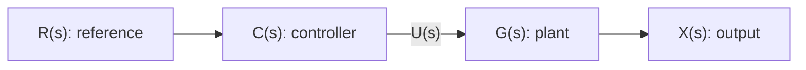
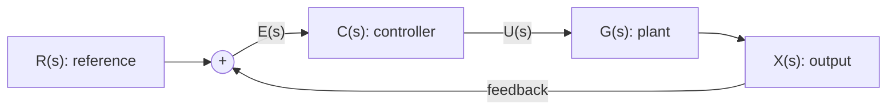

## Estimating a System Output

There are two common ways to obtain a system output $x(t)$:

1. Model the system with differential equations and solve them for $x(t)$.
2. Find the impulse response $h(t)$ and compute the output from an input $u(t)$ using convolution:

$$
x(t)=u(t)*h(t).
$$

## Linear Time-Invariant Systems

An LTI system satisfies both linearity and time invariance.

### Linearity

If

$$
u_1(t)\rightarrow x_1(t), \qquad u_2(t)\rightarrow x_2(t),
$$

then, for constants $\alpha$ and $\beta$,

$$
\alpha u_1(t)+\beta u_2(t)
\rightarrow
\alpha x_1(t)+\beta x_2(t).
$$

This property combines homogeneity and additivity.

### Time invariance

If

$$
u(t)\rightarrow x(t),
$$

then shifting the input by $\tau$ produces the same shift in the output:

$$
u(t-\tau)\rightarrow x(t-\tau).
$$

## Impulse Response and Convolution

The impulse response $h(t)$ is the output of an LTI system when the input is a unit impulse at $t=0$.

Over a short interval $[\tau,\tau+\Delta\tau]$, the input contributes approximately

$$
x_\tau(t)=u(\tau)\Delta\tau\,h(t-\tau).
$$

Summing all contributions and taking the limit gives the convolution integral:

$$
x(t)=\int_0^t u(\tau)h(t-\tau)\,d\tau=u(t)*h(t).
$$

## Laplace Transform

The one-sided Laplace transform is

$$
F(s)=\mathcal{L}\{f(t)\}=\int_0^\infty f(t)e^{-st}\,dt.
$$

### Example

For $f(t)=e^{-at}$,

$$
\begin{aligned}
\mathcal{L}\{e^{-at}\}
&=\int_0^\infty e^{-(a+s)t}\,dt \\
&=\frac{1}{s+a}, \qquad \operatorname{Re}(s+a)>0.
\end{aligned}
$$

### Convolution theorem

Convolution in the time domain becomes multiplication in the Laplace domain:

$$
\mathcal{L}\{f(t)*g(t)\}=F(s)G(s).
$$

## Partial-Fraction Decomposition

Partial fractions make inverse Laplace transforms easier. For example,

$$
X(s)=\frac{c}{s(a_1s+a_2)}
=\frac{c}{a_2}\left(\frac{1}{s}-\frac{1}{s+\frac{a_2}{a_1}}\right).
$$

Each term can then be transformed back to the time domain using a standard Laplace-transform table.

## Control Systems

### Open-loop control

An open-loop controller sends a command to the plant without measuring the output for correction.

The transfer function from reference to output is

$$
\frac{X(s)}{R(s)}=C(s)G(s).
$$

### Closed-loop control

A closed-loop controller feeds the measured output back to the input and uses the error $E(s)$ to correct the system.

For unity negative feedback,

$$
E(s)=R(s)-X(s), \qquad X(s)=G(s)C(s)E(s),
$$

so the closed-loop transfer function is

$$
\frac{X(s)}{R(s)}=\frac{C(s)G(s)}{1+C(s)G(s)}.
$$
