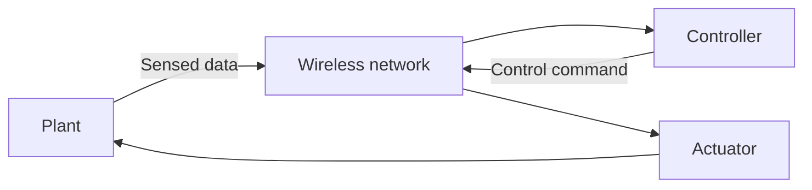

## Cyber-Physical System Components

A cyber-physical system (CPS) combines computation, communication, and physical processes. Its main components are:

1. **Plant**
   - Sensors
   - Actuators
2. **Controller**
3. **Wireless network**
   - Connects multiple nodes and carries data and control flows

The plant sends sensed data to the controller. After computing a control decision, the controller sends a control flow back to the plant's actuators. These components communicate through the wireless network.

## Inside the Wireless Network

### Cyber layer: network manager

The network manager monitors and reconfigures the wireless network. After a configuration change, the network acknowledges the network manager.

### Physical layer: controller and plant

The controller actuates the plant, while sensors measure the plant's state and return observations to the controller.

When developing a CPS, the cyber and physical parts should be designed as one system. Joint design can reveal optimization opportunities that are missed when networking, computation, and control are considered independently.

## Timing and Signal Processing

Engineers usually assign conservative deadlines to sensing and control flows so that the system remains safe under worst-case conditions.

Fourier analysis is useful for decomposing and processing sensor signals, while control theory determines how the system should respond to those signals.
