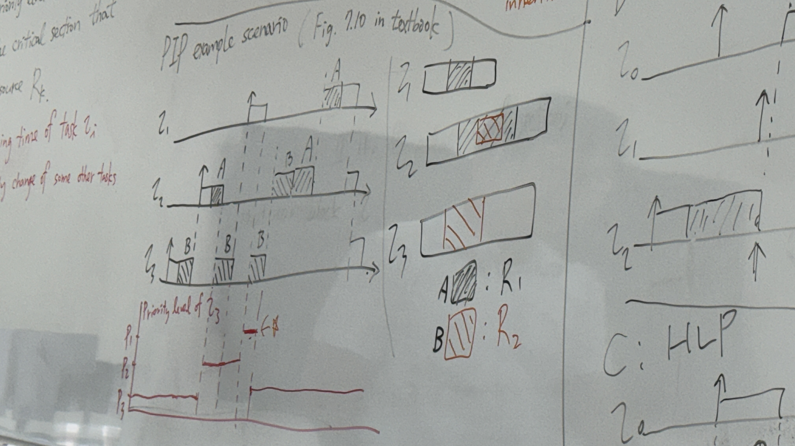
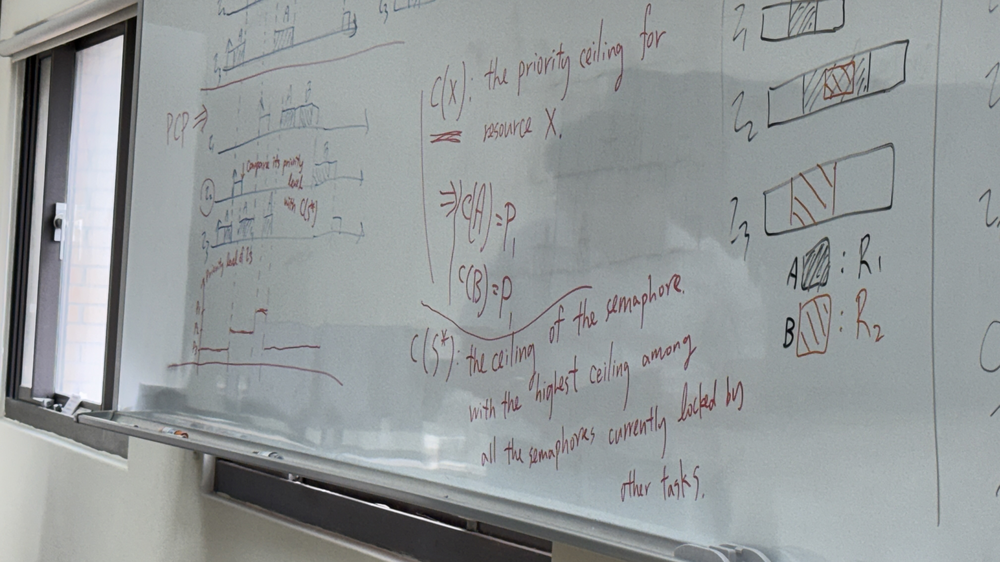

## deadline


### where are deadline come from

## type of Real-time system
### hard real-time system
#### definition
If producing results after deadline, then it will give seriously bad consequence. e.g. earthquake warning

### soft real-time system
#### definition
If producing results after deadline, then it will give lower utility. e.g. live streaming, online multiplayer game

### firm real-time system
#### definition
If producing results after deadline, then it will be useless.

## model
$\Gamma: \text{task set: }{\tau_1 , \tau_2, \tau_3 ,...}$\
Tasks have many type, some of them are period task, some just one-time task(only one job), also have other\
$j_i$: job in task $\tau_i$\
R: Response time of Real time system is finish time - arrival time\
$T_i$: time period of job in task\
$C_i$: execution time (in the worst case)\
$U$: CPU utilization = sum of CPU use time percentage($[ \sum_{i} \frac{C_i}{T_i}]$)
## algorithm
### optima
if one of the algorithm is schedulable, optima algorithm is also schedulable.\
if there is some scheduler can schedule some sub-task, the optima can also schedule those.(not mean it can schedule all task set, but for all of other schedule can)
### example
- priority $j_i>j_j for i<j$
- non-preemptive
- schedule according to priority order

$\tau_1 \rightarrow \tau_5, \tau_2 \rightarrow \tau_3 / \tau_4$

```
CPU1: j2 j2 j3 j3 j4 j4
CPU2: j1 j5 j5 j5 j5 
```
but if $c_2 = 1$ will become:
```
CPU1: j2 j4 j4
CPU2: j1 j3 j3 j5 j5 j5 j5 
```

### critical section handle problem(priority inversion)
In the critical section, higher priority task may delay because before higher priority may wait before executing critical section and the lower is executing higher priority task first.

For example(T1 > T2 > T3):
```
c: critical section, w: wait, n: normal, X: no execution
T1: X X X X n n w w w w w w c c c c n n F X X
T2: X X X X X X X n n n n F X X X X X X X X X 
T3: n n c c w w c w w w w c w w w w w w w n F
```

middle priority task that can preempt higher priority task
# Rate-monotonic(RM) scheduling
## assumption
1. periodic hard-real-time tasks
2. deadlines consist of run ability constraint (i.e, implicit deadline)
3. tasks have no dependency
4. constant execution time for each job of a task
5. focus only on periodic hard-real-time jobs (same as 1.)
## fix priority preemptive scheduling (FP)
for example, STCF isn't FP\
// with FP, we can have run Queue, and take first job and wait until job finish, then take first again\
## worst-case (most challenging case) analysis
we should consider the worst case
### critical instant
there is n higher priority tasks, has job release at same time as target task $\tau_i$ did\
and we can consider them as 1 higher priority task $\tau_0$ (impact same as n tasks)\
we can know that shift the time of $\tau_0$'s job won't affect response time of $\tau_i$, because it is still inside the response time of $\tau_i$\
so the worst case is the $\tau_0$ arrival time same as $\tau_i$

for different priority order, the execution time of longer:
```
=: executing, ^: arrive -: idle
t1|^==---^==---^==---^
t2|^--=== --=== --===^

t1|^===-- ----- -----^
t2|^---==^==---^==---^


vvXXXXXincorrectXXXXXvv
t1|^===== ====- -----^
t2|^---XX^---X=^==---^
```
$\Rightarrow$ task has longer period should have lower priority is better

### analysis $T_1$ and $T_2$
suppose $T_1>T_2$
```
τ₁|^----- ----- ---^--
τ₂|^-----^-----^-----^
```
There will be $\lceil{\frac{T_1}{T_2}}\rceil$ arrivals of jobs of $\tau_2$ within two arrivals of $\tau_1$(longer over shorter)\
There will be $\lfloor{\frac{T_1}{T_2}}\rfloor$ arrivals of jobs of $\tau_2$ whose deadline fall within $T_1$

If we set $\tau_1$ to be of a higher priority, than fot $\tau_1$, than for $\tau_1$ and $\tau_2$ both be schedulable, we need $c_1 + c_2 \leq T_2 \Rightarrow \lceil{\frac{T_1}{T_2}}\rceil C_1+\lceil{\frac{T_1}{T_2}}\rceil C_2\leq\lceil{\frac{T_1}{T_2}}\rceil T_2\leq T_1$\
imply\

If we set $\tau_1$ to be of a higher priority, than fot $\tau_1$, than for $\tau_1$ and $\tau_2$ both be schedulable, we need $\lfloor{\frac{T_1}{T_2}}\rfloor C_2+C_1\leq T_1$\

independent with $C_1, C_2$, only consider with arrival rate
## Theorem
### Theorem 1
A critical instant for any task occurs whenever the task is requested simultaneously with requests for all priority tasks.
### Theorem 2
If a feasible priority assignment exists for some task set, the rate-monotonic priority assignment will be feasible for that task set tool
## task set utilization (aka utilization factor of the task set)
$\sum_i \frac{C_i}{T_i}$\
$U\leq ln2=0.693\rightarrow schedulable$\
$U\leq n(2^{\frac{1}{n}}-1)$\
if only two tasks than as long as $U\leq 2(\sqrt{2}-1)=0.83$ than the task set is schedulable using RM(but not mean if higher than 0.83 not schedulable)
### proof of the sufficient schedulability test $U\leq 2(\sqrt{2}-1)$
$T_1 > T_2$\
#### Case 1
$\tau_2$ next job came after $\tau_1$ finish

$C_1 \leq T_1 - T_2 \lfloor \frac{T_1}{T_2} \rfloor \Rightarrow$ 
The longest possible value of $C_2$ is $C_2 = T_2 - C_1 \Rightarrow U = \frac{C_1}{T_1} + \frac{C_2}{T_2} = 1 + C_1 (\frac{1}{T_1} - \frac{1}{T_2}) = f(C_1)$

if $C_1$ decrease, $U$ increase 
if $C_1$ increase, $U$ decrease

#### Case 2
$\tau_2$ next job came before $\tau_1$ finish

$C_1 \geq T_1 - T_2 \lfloor \frac{T_1}{T_2} \rfloor \Rightarrow$ 
The longest possible value of $C_2$ is $C_2 = \frac{T_1 - C_1}{\lfloor \frac{T_1}{T_2} \rfloor + 1}$
$\Rightarrow U = \frac{C_1}{T_1} + \frac{C_2}{T_2} = \dots = \frac{1}{T_2} \cdot \frac{T_1}{\lfloor \frac{T_1}{T_2} \rfloor + 1} + C_1 (\frac{1}{T_1} - \frac{1}{T_2(\lfloor \frac{T_1}{T_2} \rfloor + 1)})$
$(C_1 (\frac{1}{T_1} - \frac{1}{T_2(\lfloor \frac{T_1}{T_2} \rfloor + 1)})) > 0$

if $C_1$ decrease, $U$ decrease
if $C_1$ increase, $U$ increase

#### summarize
$C_1=T_2 - T_1\lfloor{\frac{T_1}{T_2}}\rfloor$
$\Rightarrow U=\frac{C_1}{T_1}+{C_2}{T_2} = ...... \leq 2(\sqrt{2}-1)$\
## EDF
EDF is a optimal scheduler, if $U < 1$. But in real world, the dynamic scheduling may have some other cost

## real-time servers
a server to handle the aperiodic task, and also try to give good response time for aperiodic task, and also try to guarantee the schedulability of periodic task. that get balance between the two type of task.
### aperiodic task and periodic task
For real-time system, we usually have two type of task, periodic task and aperiodic task.\
The system should guarantee the schedulability of periodic task, and also try to give good response time for aperiodic task.
#### periodic task
task that has a job release at regular interval, and the deadline is same as the period.
#### aperiodic task
also called non-periodic task, task that has a job release at irregular interval, and the deadline is not same as the period.
### shipboard computing
Computing on a ship (usually for military), for example, the ship has a radar system, and cannon system, the radar system is periodic task, and the cannon system is aperiodic task.

Aperiodic task may delay the periodic task, so we need to design handle the aperiodic task that can be predictable, and also try to give minimum response time that won't delay the periodic task to miss the deadline.

### key idea
create a periodic task to serve aperiodic task and control their interference to the rest of periodic tasks.
### way to serve aperiodic task
Add a periodically scheduled budget of execution time for aperiodic task, and also give a period for the budget.\
Once the aperiodic task arrive, it can use the budget to execute, and if the budget is used up, then it need to wait until next period to get new budget.

For the case of example in textbook, we set aperiodic task as lowest priority since we don't want to delay the periodic task, and just make the aperiodic budget scheduled as a periodic task to make it predictable, and also try to give good response time for aperiodic task.
 
### schedulability test
let $U_p$ be the utilization of all periodic task, and $U_s$ be the utilization of the server where $U_s = \frac{C_s}{T_s}$, $\Rightarrow U_p + U_s \leq n(K^{\frac{1}{n}}-1)$, where $K = \frac{2}{U_s+1}$

then we need $U_p + U_s \leq (n+1)(2^{\frac{1}{n+1}}-1)$ to guarantee the schedulability of all periodic task, and also try to give good response time for aperiodic task.

#### worst task configuration
assumed 100% workload,
from server, $\tau_1$, $\tau_2$ to $\tau_n$s' period $T_s$, $T_1$... from min to max correspond RM priority，and $C_1 = T_1 - T_s$, $C_2 = T_2 - T_1$... $C_n = T_n - T_{n-1}$ reach 100% workload

```
Ts|==------|==
T1|--=-------|=
T2|---=-------|=
```
$\begin{cases} C_{n-1} = T_n -T_{n+1} \\\\
C_n = T_s - C_s - \sum_{i=1}^{n-1} C_i\end{cases}$\
$C_s + \sum_{i=1}^{n-1} C_i = T_n - T_s$\
$\Rightarrow C_n = T_s - (C_s + \sum_{i=1}^{n-1} C_i) = T_s - (T_n - T_s) = 2T_s - T_n$

$U = \frac{C_s}{T_s} + \sum_{i=1}^{n} \frac{C_i}{T_i} 
= U_s + \sum_{i=1}^{n-1} \frac{C_i}{T_i} + \frac{C_n}{T_n}
= U_s + \sum_{i=1}^{n-1} \frac{T_i - T_{i-1}}{T_i} + \frac{2T_s - T_n}{T_n}
= U_s -n + \sum_{i=1}^{n-1} \frac{T_{i+1}}{T_i} + \frac{2T_s}{T_n}$\
$= U_s - n + \frac{T_2}{T_1}+\frac{T_3}{T_2} + ... + \frac{T_n}{T_{n-1}} + (\frac{2T_s}{T_1}\frac{T_1}{T_n})$\
now let $R_i = \frac{T_{i+1}}{T_i}$ and K = $\frac{2T_s}{T_1}$, we have $U = U_s - n \sum^{n-1}{i=1}R_i + K\frac{T_1}{T_n}$\
rate that $\frac{T_n}{T_1} = \frac{T_n}{T_{n-1}} \cdot \frac{T_{n-1}}{T_{n-2}} \cdot ... \cdot \frac{T_2}{T_1} = R_{n-1} \cdot R_{n-2} \cdot ... \cdot R_1 = \prod_{i=1}^{n-1} R_i$\
$\Rightarrow U = U_s - n + \sum_{i=1}^{n-1} R_i + K\frac{T_1}{T_n} = U_s - n + \sum_{i=1}^{n-1} R_i + K\frac{1}{\prod_{i=1}^{n-1} R_i} = f(R_i)$

To find the minimum of U, we can compute $\frac{df(R_i)}{dR_i} = 0$ for each $R_i$\
$\Rightarrow \frac{df(R_i)}{dR_i} = 1 - K\frac{1}{\prod_{j=1}^{n-1} R_j} \cdot \frac{1}{R_i} = 0$\
$\Rightarrow \frac{K}{R_i \prod_{j=1}^{n-1} R_j} = 1$ for each $R_i$\
we choose $R_1 = R_2 = ... = R_{n-1} = K^{\frac{1}{n}}$ to satisfy the above equation

$\Rightarrow U = U_s -n + \sum_{i=1}^{n-1} K^{\frac{1}{n}} + K\frac{1}{K^{\frac{n-1}{n}}}$
$=U_s -n + (n-1)K^{\frac{1}{n}} + K\frac{1\cdot K^{\frac{1}{n}}}{K^{\frac{n-1}{n}} K^{\frac{1}{n}}}$
$=U_s -n + (n-1)K^{\frac{1}{n}} + K^{\frac{1}{n}}$
$=U_s + n(K^{\frac{1}{n}} - 1)$#
The lowest upper bound for $U_p$ is $n(K^{\frac{1}{n}}-1)$

from $K=\frac{2T_s}{T_1}$ and $U_s=\frac{C_s}{T_s} -1 \Rightarrow U_s+1=\frac{T_1}{T_s}$
$\Rightarrow K = \frac{2}{U_s+1}$

### defferable server vs polling server
#### defferable server
the server will execute the aperiodic task **immediately** when it arrive, and if the budget is used up, then it need to wait until next period to get new budget.\
the response time of aperiodic task is better than polling server, but it may cause more interference to periodic task

#### polling server
only the there is aperiodic task arrive before the server's period, then the server will execute the aperiodic task immediately when it arrive, else the server will idle until next period to check if there is aperiodic task arrive.
## resource access protocols
the protocols is designed to handle the critical section problem, and also try to get predictable response time.

## Multi-criticality Systems with Varying Degrees of Execution Time Assurance
### harmonic period
If all the task starting in critical instant, since all the task is the smallest's period's integer multiple, so the critical instant will come back again in the same period.

### criticality
the criticality isn't same as the priority\
the criticality is about how bad the consequence if the task miss the deadline.

### Multi-criticality Systems
In this case, high criticality task will take most execution time and run the complex task, the low criticality task will take less execution time and easy task.\
### schedulability analysis
For criticality level $L = {A, B, C, D}$\
$C_ij$: execution time of task $\tau_i$ viewed from criticality level $j$\
$\tau_1$: $T=D_1 = 2$, $L_1 = A$, $C_{1A} = 2$, $C_{1B} = 1$\
$\tau_2$: $T=D_2 = 4$, $L_2 = B$, $C_{2A} = 1$, $C_{2B} = 1$
#### preemptive fixed priority scheduling
if assign $\tau_1$ with a higher priority $\Rightarrow$ the system is deemed unschedulable.\
if assign $\tau_2$ with a higher priority $\Rightarrow$ the system is deemed schedulable.

## solution of priority inversion
fix the problem of "pathetic" priority inversion

For all of them are try to reduce the response time. And we use blocking time to explain it.
### Non-preemptive protocol(NPP)
put the time that **into** the critical section into the highest priority, so that won't cause priority inversion since the critical section will be executed immediately when it arrive. 
After the critical section, the task return to the original priority, and also give the chance for other task to preempt.
### Highest locker priority protocol(HLP)
when a task enter the critical section, it will inherit the highest priority of all the **task that enter the same critical section**, other part is same as NPP.\
so the task that has the highest priority and don't enter the critical section won't be affected.
### Priority inheritance protocol(PIP)
it will **inherit the highest priority** that is **blocked by the same critical section** and wait for it finish critical section **now**.


This has some situation that make it has higher blocking time than HLP, NPP. so we have the priority ceiling protocol(PCP) to solve this problem.
### Priority ceiling protocol(PCP)
$C(x)$: the priority ceiling of resource $x$\
We can determine before execution, we ceiling the priority of the critical section, and also ceiling the priority of the task that enter the critical section to the ceiling priority of the critical section.\
$C(S^*)$: the ceiling of the semaphore with the highest ceiling among all the semaphores currently locked by other tasks



Which means that when we enter the critical section, we will set the priority of the task to the highest priority of all the task that may use the same critical section. only the task that has higher priority than the ceiling priority or the task that has higher priority than origin priority and is in non-critical section(don't has any other critical section) can preempt the task that is in critical section.\

in pthread support PIP and PCP
### blocking time analysis
<!-- delay of the origin higher priority task that caused by the lower priority task that is executing critical section. (time that from the **end** of the critical section that executing(may be the lower priority task) to the next same critical section(may be the higher priority) **start** execute again) \ -->、
blocking time: the time that the higher priority task is delay by the lower priority task.
<!-- why not max P + 1 -->
$P_i$: nominal priority level of task $\tau_i$\
$P_i(R_k)$: atomic priority level of $\tau_i$ when it enters the critical section that utilizes resource $R_k$\
$B_i$: maximum blocking time of task $\tau_i$ due to the priority change of some other tasks


$B_i = max_{j,k}\{\delta_{j,k} | Z_{j,k} \in r_n\}$ (the longest critical section of $\tau_j$ guarded by section $S_k$); ($\delta_{j,k}$ is duration of $Z_{j,k}$; $Z_{j,k}$ is the longest critical section of $\tau_j$ guarded by semaphore $S_k$ )\
$r_i$: the set of all the longest critical sections that can block $\tau_i$\
$r_i$: $U_{(j: P_j < P_i)}$ $r_{i,j}$, where $r_{i,j} = \{Z_{j,k} | s_k\in \sigma_{i,j} \}$, where $\sigma_{i,j}$ is the set of semaphores(used by some lower-priority tasks $\tau_j$) that can block $\tau_i$

- NPP: $P_i(R_k) = max_h\{P_h\}$
- HLP: $P_i(R_k) = max_h\{P_h | \tau_h \text{ uses } R_k\}$
- PIP: $P_i(R_k) = max \{ P_i, max_h\{P_h | \tau_h \text{ is blocked on } R_k\}\}$ (priority inheritance: $max_h$....)

For the PIP, the blocking time is the time that the **waiting** for other critical section to finish


