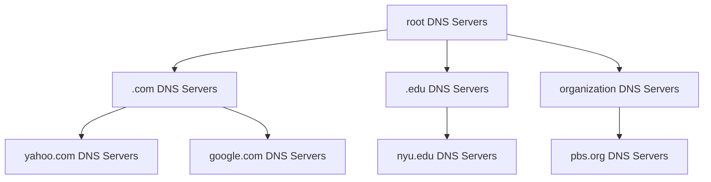

## architecture
### client-server paradigm
client 連到 server，不會直接跟其他 client 連線，
server 始終上線，client IP 可能是 dynamic IP
### peer-to-peer paradigm
client 直接跟其他 client 連線，不需要 server，也就是把兩邊皆作為 client 跟 server，
會有 client process 跟 server process

## Processes communicating
### inter-process communication
same host 上的 process 互相溝通會用 IPC 來溝通，像是 pipe
### different host
不同 host 上的 process 會用 message 來溝通

## sockets
process 跟 transport layer 溝通的介面，用來把 message 跟 transport layer 收發
### Addressing processes
每個 process 需要 identifier 去接收 message，所以會需要 IP address + port number

### application-layer protocol defines
#### types of messages exchanged
request, response
#### message syntax
message format
#### message semantics
meaning of fields
#### rules 
for when and how processes send and respond to messages

### protocols
#### open protocols
HTTP, SMTP, FTP, DNS
#### proprietary protocols
Skype, Zoom

### TCP service
- reliable transport
- flow control
- congestion control
- connection-oriented
- does not provide
  - delay guarantees, bandwidth guarantees, security

### UDP service
- unreliable transport
- does not provide
  - reliability, flow control, congestion control, timing, throughput guarantee, security, or connection setup
#### Vanilla TCP/UDP sockets
基礎的 TCP/UDP，沒有加密
#### Transport Layer Security (TLS)
加密 TCP，並在 application layer 實踐，有 data integrity（完整性），並且是 end-point authentication
## RTT
一個 packet 從 client 傳到 server 再回來的時間
## HTTP
### overview
HyperText Transfer Protocol，client-server model，
然後是 stateless protocol（不會有之前 request 的資訊）因為要 implement 很麻煩
#### stateful protocol
會有之前 request 的資訊，會要求一次做完，會需要在收到下一個 request 才會記錄 state
### HTTP uses TCP
會向 server 的 port 80 發 request，並且 HTTP message 會在 web browser(client) 跟 web server 之間傳送
### non-persistent HTTP
每個 object 都會開一個 TCP connection，下載完就關掉，每送一個 object 會需要 2 RTT（1 RTT for TCP connection, 1 RTT for HTTP request/response）\
HTTP/1.0 預設是 non-persistent HTTP
### persistent HTTP
在同一個 TCP connection 下載多個 object，全部結束後才關掉，所以最後會趨近 1 RTT（不影響中間丟的 message send/receive 數量）\
HTTP/1.1 預設是 persistent HTTP
### methods
#### POST
user input sent from client to server in entity body of HTTP POST request message
#### GET
include user data in URL field of HTTP GET request message (following a ‘?’)
#### HEAD
requests headers (only) that would be returned if specified URL were requested with an HTTP GET method
#### PUT
uploads new file (object) to server.\
completely replaces file that exists at specified URL with content in entity body of POST HTTP request message

### state keeping
#### protocol endpoints
從 sender/receiver 去記錄多個 transaction 狀態
#### cookies
在 HTTP message 的 cookie 去 maintain state

## caching
### web cache
#### example
access link rate: 1.54 Mbps\
institutional network: 1 Gbps LAN\
RTT from router to server: 2 s\
object size: 100 K bits\
average request rate: 15 / sec $\Rightarrow$ 1.5 Mbps

##### performance
access link utilization = .97 $\Rightarrow$ 接近 1 所以 loading 很重\
LAN utilization = .0015 $\Rightarrow$ loading 很輕\
end-to-end delay = Internet delay + access link delay + LAN delay = 2 s + minutes + usecs\

##### options
buy a faster access link(154 Mbps) $\Rightarrow$ 貴，end-to-end delay = 2 s + usecs + usecs\
install web cache $\Rightarrow$ 便宜\
假設 40% 的 request hit rate\
60% 的 request 會到 server $\Rightarrow$ 1.5 Mbps * 60% = .9 Mbps\
access link utilization = .9 / 1.54 = .58 $\Rightarrow$ 較輕\
end-to-end delay = $0.6s \times 2.01 0.4 \times msecs \approx 1.2s$ $\Rightarrow$ 較輕
### Conditional GET
當有 object 已經在 browser cache 裡面，但是不確定是不是最新的版本\
送出 `If-modified-since: <date>` header，server 會回傳 200 OK 並傳送 data 或 304 Not Modified\
HTTP/1.0 就有

## HTTP/2
因為 HTTP/1.x 是 FCFS（first-come, first-served），所以會有 HOL (head-of-line) blocking 的問題，也就是當前面有一個很大的 object 時，後面的 object 都要等前面的傳完\
減少 multipule object 的 delay，會把 object 切成 frame，在 queue 的 object 會根據順序傳送 1 frame 依序循環。

## email
user 跟 mail server 用 SMTP protocol 連接，mail server 之間用 SMTP protocol 連接
### mail server
會有 mailbox 存放 email，message queue 存放要寄出去的 email
### SMTP RFC(5321)
用 TCP port 25，text-based protocol\
會先建立 TCP connection，然後進行 SMTP handshake、 transfer of messages、connection closure\
```
// handshaking
S: 220 mail.example.com // service ready
C: EHLO client.org
S: 250 Hello client.org, pleased to meet you
// transfer of messages
C: MAIL FROM: <alice@client.org>
S: 250 alice@client.org... Sender ok
C: RCPT TO: <bob@mail.example.com>
S: 250 bob@mail.example.com ... Recipient ok
C: DATA
S: 354 Enter mail, end with "." on a line by itself
C: Do you like ketchup?
C: How about pickles?
C: .
S: 250 Message accepted for delivery
// closing connection
C: QUIT
S: 221 mail.example.com closing connection
```

### mail access protocols
#### IMAP
Internet Message Access Protocol，用來從 mail server 去讀 email
#### HTTP
Gmail, Hotmail 就是用 HTTP 去讀 email

## DNS
application layer protocol，而且是 distributed database（在很多不同的 name server 上面）\
hostname to IP address translation
### distributed, hierarchical database


會照順序從上而下找到 Root, Top-level domain, Authoritative 然後再去找到 subdomain 的 IP address\
如 .com $\rightarrow$ yahoo.com $\Rightarrow$ www.yahoo.com
#### TLD
各個 TLD 擁有者有會有 DNS server
#### Authoritative
認證的 DNS server，organization 自己會有自己的 DNS server
#### local DNS
會 cache DNS 資訊一段時間（36 hr 之類的）\
基本上都是沒有認證的 DNS，也不會算在 hierarchi 裡面\
如臺大每個系所都有 local DNS server、ISP 業者也會有自己的 local DNS

### iterated
先問 local DNS，當不知道就會得到說去問 root，在不知道就會從 root 得到去問 TLD...
### recursive
問 local 找不到，local 會去往 root 問，然後再往下問，最後把結果回傳給 user，會讓 root DNS loading 很重
### DNS records
都會記錄成 resource records (RR)，形式是 (name, value, type, ttl)\
ex: (www.example.com, 192.0.2.1, A)\
可以用 nslookup，搭配 `set TYPE=<type>` 以及 domain name 去查詢 DNS record
#### A type
name 是 hostname，value 是 IPv4 address
#### AAAA type
name 是 hostname，value 是 IPv6 address
#### CNAME type
用來找正式 domain name 的別名，name 是 alias name，value 是 canonical(real) name
#### NS type
name 是 domain，value 是 authoritative name server 的 hostname（如 ntuns.ntu.edu.tw）
#### MX type
name 是 domain，value 是 mail server 的 hostname（如 mail.example.com）

## P2P
每個 user 都是 client/server\
### self scalability
當新的 peer 加入除了增加新的 service capacity（容量）之外，還會增加 service demand（需求）
### intermittent connectivity
peer 可能會隨時上線或下線以及更改 IP address，管理複雜化
### usage
P2P file sharing (BitTorrent), streaming (KanKan), VoIP (Skype)
### P2P vs client-server
假設 File size $F$, Server upload rate $u_s$, Number of peers $N$, Peer download rate $d_i$, Peer upload rate $u_i$
#### client-server
$\frac{NF}{u_s}$（Server 上傳 N 次 file 給所有 user 的時間）, $\frac{F}{\min(u_s, d_{min})}$（最慢的 user 下載完 file 的時間）\
所以 total time $\geq \max(\frac{NF}{u_s}, \frac{F}{\min(u_s, d_{min})})$

花費時間根據使用人數成長曲線會是 linear

#### P2P
$\frac{F}{u_s}$（Server 上傳 1 次 file 給其中一個 user 的時間）, $\frac{F}{d_{min}}$（最慢的 user 下載完 file 的時間）, $\frac{NF}{u_s + \sum u_i}$（所有 user 上傳完 file 的時間，應該是 N-1 但就 approx）\
所以 total time $\geq \max(\frac{F}{u_s}, \frac{F}{d_{min}}, \frac{NF}{u_s + \sum u_i})$

花費時間根據使用人數成長曲線會最後趨近一個值
### BitTorrent
會把檔案切成 $256 Kb$ 的 chunks
#### tracker
追蹤所有 peers 在 torrent 內的資訊
#### torrent
group of peers 去 exchange chunks of a file
#### peer joining
一開始沒有資料，會慢慢從其他 peer 那邊下載 chunks，並且會去跟 tracker 登記並取得 list of peers，然後會去跟 list 中的部分連接（neighbors）
#### churn
peers 會隨時上線或下線
#### list of chunks
會用 bitmap 去記錄自己擁有的 chunks
#### exchanging chunks
會隨時可能換 exchange chunks 的 peer
#### requesting chunks
會去跟 peers 要 list of chunks，並且會去下載自己沒有的 chunks（從最少的開始下載）
#### tit-for-tat
只會上傳檔案給 top 4 peers for currently sending chunks，並且每 $10s$ re-evaluate 一次，然後每 $30s$ 會隨機選擇一個不在 top 4 的 peer 傳送檔案

這樣可以避免只上傳不下載的人，也可以間接得到 higher upload rate 的 peer
#### selfish/altruistic
當擁有整個檔案即下線的 peer 是 selfish，會繼續上傳給其他 peer 的是 altruistic

## multimedia
### video encoding
#### spatial encoding
只有在單張使用
#### temporal encoding
當前跟下一張去 encode
#### CBR
Constant Bit Rate，保持固定的位元率
#### VBR
Variable Bit Rate，根據影像內容的複雜度調整位元率，並去改 spatial 跟 temporal encoding 的量
### streaming
encoding + DASH + playout buffering
#### continuous playout constraint
會希望 client playout time 跟原始的一致\
但實務上會遇到 network delay 會變化（jitter）、pause、加速播放...

#### client-side buffering
會在 client 端預先緩衝一段時間的資料，以應對 network delay 和 jitter 的影響，確保播放的連續性和流暢性
### DASH(Dynamic Adaptive Streaming over HTTP)
#### server
把 video 切成 chunks，每個 chunk 都會用不同 rate encode 去 encoding，不同 rate 儲存成不同檔案，方便選擇。並且會把檔案儲存在多個 CDN 內，在不同 chunks 也會用不同 URL 去處理
#### client
會根據網路去 estimates bandwidth，並選擇合適的 chunk 進行播放\
並且根據 manifest file（會記錄每個 chunk 的 URL、duration、available bit rates）去下載一個 chunk（最符合 bandwidth）\
而大部分決策都是在 client 端做的，包括何時 request、哪個 rate、哪個 server（有最高 bandwidth 的 URL）

### CDN(Content distribution networks)
把多個資料 copy 分散在多個 geographically distributed sites
#### request content
server 會給 client manifest file，client 會根據 manifest file 去找 highest supportable rate，並且可能會因為 congestion 去改變 request rate/copies

#### OTT challenges
從 edge 端解決 congestion，要考量要把 content 放在哪裡，client 要從哪個 CDN node 拿，要用什麼 rate
