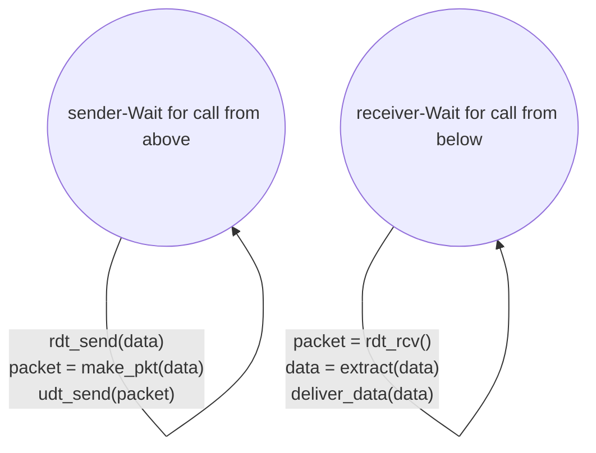
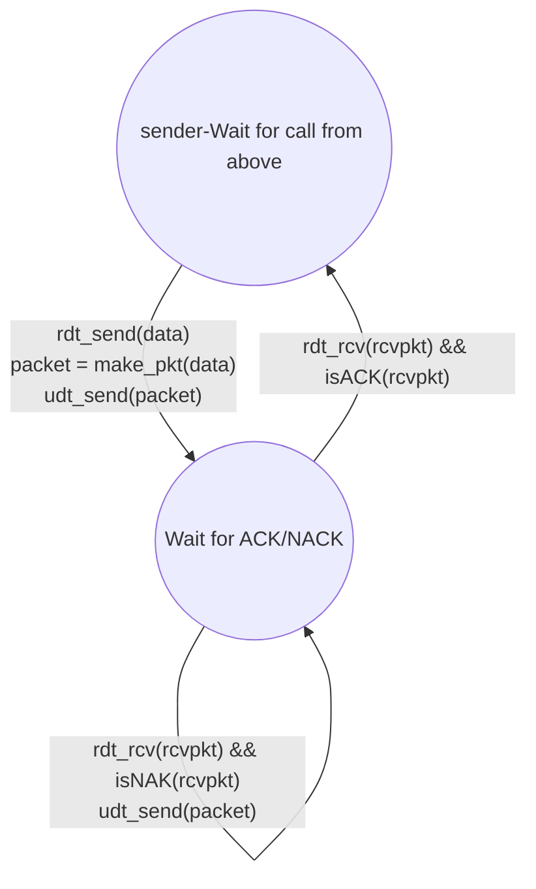

## transport vs network layer
transport layer 是 process-to-process\
## transport layer protocols
TCP, UDP, ...
### TCP
TCP 有 Source Port, IP 跟 Destination Port, IP
- reliable, in-order delivery
- congestion control
- flow control
- connection setup
#### header
source IP, Dest IP, source port(16 bits), destination port(16 bits), other header fields
### UDP
- unreliable, unordered delivery
- no-frills extension of "best-effort" IP service

## multiplexing and demultiplexing
### multiplexing
會把不同 socket 的
就像高速公路多個閘道匯集到同一條路
### demultiplexing
收到會根據 IP address 跟 port number 送到不同 socket
就是類似高速公路路牌的概念

UDP 一個 port 只會有一個 socket（沒有 connection oriented）\
TCP 一個 port 會有多個 socket（connection oriente，會根據 source IP 去到不同 socket），另外 server 還會有一個額外的 welcome socket

----期中範圍----
## UDP
connectionless, unreliable service, best-effort delivery（代表不一定送到，而且順序不確定）

### application examples
- DNS
- SNMP
- HTTP/3
- streaming multimedia apps
現行大部分的 streaming app 都用 UDP，因為不需要可靠傳輸，反而需要低延遲
### UDP checksum
去檢查 transmission segment 出現的錯誤，並且可能可以透過這個修正\
把兩個字元當作 16 bits integer，加起來，當溢位時把多出來的 bit 加到最後面，然後 checksum 就是這個和去做 not 的結果\
但錯誤檢查能力不強，因為有可能兩個錯誤抵銷掉

## reliable data transfer(RDT)
sender 呼叫 `rdt_send()` 去傳資料 `rdt_rcv()` 收資料\
### rdt 1.0
假設底層傳輸不會出錯\
sender 端就是等上層資料，然後再去打包成 packet，並用 `udt_send()` 傳送\
receiver 端就是等 `rdt_rcv()` 收到 packet，然後把資料送到上層

### rdt 2.0
有 ACK/NACK 機制去處理 bit error\
但有可能 ACK/NACK 本身也會出錯
#### ACK(acknowledgement)
receiver 收到正確的 packet 後會回傳 ACK 給 sender\
#### NACK(negative acknowledgement)
receiver 收到錯誤的 packet 後會回傳 NACK 給 sender\
#### sender side
sender 會等 ACK/NACK 回傳\
收到 ACK 就傳下一個 packet\
收到 NACK 就重傳剛剛的 packet

#### receiver side
receiver 收到 packet 後會檢查有沒有錯誤\
沒有錯誤就回傳 ACK 給 sender，並把資料送到上層\
有錯誤就回傳 NACK 給 sender，並丟掉
### rdt 2.1
解決 ACK/NACK 也會出錯的問題\
#### sender side
sender 會根據 sequence number 去判斷 ACK/NACK\
就是會先傳 sequence number 0 的 packet\
收到 ACK 0 就傳 sequence number 1 的 packet\
收到 NACK 就重傳 sequence number 0 的 packet\
收到 ACK 1 就傳 sequence number 0 的 packet\
當傳送 sequence number 1 時也同理\
有四個 state send 0, wait for ACK0, send 1, wait for ACK1\

#### receiver side
receiver 會根據 sequence number 去判斷是不是重複的 packet\
收到正確的 packet 就回傳 ACK 並送到上層\
收到錯誤的 packet 就回傳 NACK 並丟掉然後繼續等\
會有兩個 state，wait for 0, wait for 1
### rdt 2.2
把 NACK 拿掉，改成 ACK 上次的 sequence number
### rdt 3.0
基於 rdt 2.2 ，並加上 timeout 機制去處理 packet loss 的問題\
有 pipeline 的功能，也就是可以同時傳多個 packet\
#### sender side
除了 ACK 機制外，還會有 timeout 機制\
傳送 packet 後會啟動計時器\
收到 ACK 就停止計時器並傳送下一個 packet\
timeout 就重傳剛剛的 packet 並重新啟動計時器
#### receiver side
跟 rdt 2.2 一樣
### performance of rdt protocols
#### utilization
假設每次傳送的 packet 大小為 L bits，傳輸速率為 R bps，單程延遲為 d sec\
那傳送一個 packet 的時間為 L/R sec\
單程延遲為 d sec\
來回延遲 RTT 為 2d sec\
那 utilization U 為 $U_{sender} = \frac{L/R}{RTT + L/R} (RTT>> L/R)$\
rdt 3.0 的 performance 很低，所以需要 pipeline 的機制去提升 utilization
## pipelining
可以同時傳多個 packet\
Utilization 會提升（$N\cdot \frac{L/R}{RTT + L/R}$）\
### Go-Back-N(GBN)
sender 可以同時傳送多個 packet，但最多只能有 N 個未被 ACK 的 packet\
receiver 只會接受正確且符合 sequence number 的 packet，其他的都會丟掉並重傳最後一個 ACK\
#### sender side
sender 會維護一個 window，window size 為 N\
可以同時傳送 N 個 packet\
收到 ACK 就把 window 向前移動\
timeout 就重傳 window 內的所有 packet
#### receiver side
receiver 只會接受符合期待的 sequence number 的 packet\
收到正確的 packet 就回傳 ACK 並把資料送到上層\
收到錯誤的 packet 就丟掉並重傳最後一個 ACK

## TCP
point-to-point, (reliable, in-order byte stream), full duplex data, cumulative ACKs, pipelining, flow control, congestion control\
### header
| fields | size (bits) |
|--------|--------------|
| Source Port | 16 |
| Destination Port | 16 |
| Sequence Number | 32 |
| Acknowledgment Number | 32 |
| Header Length(Data offset) | 4 |
| Reserved(not used) | 3 |
| Flags(NS, CWR, ECE, URG, ACK, PSH, RST, SYN, FIN) | 6 |
| Receive Window | 16 |
| Checksum | 16 |
| Urgent Pointer | 16 |
| Options | variable |
| Data | variable |
### timeout
TCP 用 EstimatedRTT 跟 DevRTT 去計算 TimeoutInterval\
EstimatedRTT = (1-α) * EstimatedRTT + α * SampleRTT\
DevRTT = (1-β) * DevRTT + β * |SampleRT
T - EstimatedRTT|\
TimeoutInterval = EstimatedRTT + 4 * DevRTT\
### flow control
receiver 會在 TCP 的 `Receive Window` 告訴 sender 自己的 RcvBuffer 還有多少空間（rwnd）\
sender 會根據 receiver 的 `Receive Window` 去調整自己 unACKed 的傳送速率，避免 receiver 的 buffer overflow
### handshake
#### if 2-way handshake is used
- variable delays
- retransmitted messages (e.g.
req_conn(x)) due to message loss
- message reordering
- can’t “see” other side
會能因為回傳的封包卡住了，所以重傳，但是等到原本的封包抵達會重複建立連線
#### 3-way handshake
- client
  - LISTEN
  - SYNSENT
  - ESTAB
- server
    - LISTEN
    - SYNRCVD
    - ESTAB
1. client 送出 SYN (SYNbit=1, Seq=x)，進入 SYNSENT 狀態
2. server 收到 SYN，送出 SYNACK (SYNbit=1, ACKbit=1, Seq=y, Ack=x+1)，進入 SYNRCVD 狀態
3. client 收到 SYNACK，送出 ACK (ACKbit=1, Seq=x+1, Ack=y+1)，進入 ESTAB 狀態
4. server 收到 ACK，進入 ESTAB 狀態
### close connection
兩邊都送 FIN 來關閉連線，然後各自回傳 ACK
## congestion control
congestion: "too many sources sending too much data too fast for network to handle"\
會造成 packet loss, long delays，與 flow control 不同，flow control 是避免 receiver overload
### causes/costs of congestion
#### scenario 1
one router, infinite buffer, **two** flows\
input, output link capacity: R\
no retransmissions needed

當 arrival rate > R/2 時，queue 會無限增長
#### scenario 2
one router, **finite** buffer, **two** flows\
input, output link capacity: R\
retransmits lost, timed-out packets

application-layer input = application-layer output: $\lambda_{in} = \lambda_{out}$\
transport-layer input includes retransmissions : $\lambda'_{in} > \lambda_{in}$\
當 $\lambda'_{in} > R/2$ 時，queue 會滿，造成 packet loss, 此時 $\lambda_{out} < \frac{R}{2}$
#### scenario 3
four flows, multi-hop paths, time-outs, retransmissions\
當 $\lambda'_{in}$, $\lambda_{in}$ 上升，會可能把其他 flow drop 掉
#### approaches to congestion control
- Network-assisted congestion control
  - router 提供 feedback 給 sender
- End-end congestion control(TCP, ...)
  - sender infers congestion from loss, delay
  - 因為不一定擁有 router 控制權，不一定能取得 network 狀態，所以只能靠 end system 去偵測 congestion
## TCP congestion control
### AIMD
- Additive Increase, Multiplicative Decrease
- 當沒有 congestion 時，增加一個 maximum segment size(MSS) every RTT
- **當有 congestion 時（3 duplicate ACKs），減半傳送速率**
### TCP slow start
- congestion window(cwnd) 初始值為 1 MSS
- 每個 RTT，cwnd 加倍
- 當收到 ACK 時，停止 slow start
### TCP timeout
- 當 timeout 發生時，將 cwnd 設為 1 MSS，然後進入 slow start 直到原先 cwnd 的一半，接下來做 AIMD
### TCP CUBIC
對 AIMD 的改良版\
CUBIC 的核心思想是記住上一次發生擁塞時的傳送速率，稱為 Wmax（最大視窗） 。在速率被砍半後，它會依據一個三次函數（Cubic function） 來快速恢復視窗大小，這個函數的圖形像一個 S 形曲線，當前的視窗大小接近 Wmax 時，增長速度會變慢，這樣可以避免過度擁塞。
### bottleneck link
在一條路徑中，傳輸速率最低的連結稱為瓶頸連結（bottleneck link）。\
congestion control 就會把注重在這邊
### delay-based congestion control
讓中間的 pipe 剛好填滿\
measured throughput = $\frac{\text{\# bytes sent in last RTT interval}}{RTT_{measured}}$（現實 throughput）\
uncongested throughput = $\frac{\text{cwnd}}{RTT_{min}}$（理想上的 throughput）\
當 measured throughput < uncongested throughput 時，代表有 congestion，cwnd 減少\
當 measured throughput >= uncongested throughput 時，代表沒有 congestion，cwnd 增加
#### BBR(Bottleneck Bandwidth and Round-trip propagation time)
Google 開發的 congestion control algorithm\
透過估算 bottleneck bandwidth 跟 round-trip propagation time 來調整傳送速率\
避免傳送過多資料到 network 中，減少 packet loss 跟延遲\
提升網路效能
### ECN(Explicit Congestion Notification)
network-assisted congestion control 的一種\
router 會在 packet header（IP 層 ECN bit）上標記 congestion 的訊號，而不是丟掉 packet\
receiver 收到標記後會減少傳送速率，然後回傳設定 ECE bit 的 ACK 給 sender\
包括了 IP 的 ECN 跟 TCP 的 C,E bits

### TCP fairness
當多個 TCP 連線同時使用同一條路徑時，會希望每個連線都能公平地分享網路資源\
TCP 的 AIMD 機制有助於實現這一目標，因為它會根據網路的擁塞狀況動態調整傳送速率\
當一個連線經歷擁塞並減少速率時，其他連線可以利用這個機會增加它們的速率\
隨著時間的推移，這種動態調整有助於達到一種平衡，使得所有連線都能公平地使用可用的網路資源\
不過前提是 RTT 差不多的情況下，否則 RTT 較低的連線會有較高的 throughput（增加得較快）
## Fairness of internet
### UDP
UDP 沒有 congestion control 機制，所以不會理會 network congestion 的狀況
### parallel TCP connections
開多個 TCP 連線來增加 throughput\
會搶佔到其他 TCP 連線的資源，造成不公平utilization
## Evolving transport-layer functionality
### different TCP
Long, fat pipes /Wireless networks / Londelay linke / Data center networks / Background traffic flows 都有特定的 TCP "flavors"
### UDP-based reliable transport
#### QUIC (Quick UDP Internet Connections)
建立在 UDP 之上，提供類似 TCP 的可靠傳輸功能\
reliability, congestion control, authentication, crypto state\
1 handshake，connection establishment, 1 round-trip time (RTT)\
有 Error Control, Congestion Control\
多個 stream 在同一個 connection 上傳輸資料，避免 head-of-line(HOL) blocking

## TCP throughput
### TCP throughput equation
$\text{avg. TCP Throughput (in GBps)} = \frac{3}{4} \cdot \frac{W}{RTT}$\
W: congestion window size (in bytes)\
RTT: round-trip time (in seconds)\
avg. window size = $\frac{3}{4} W$\

$\text{TCP Throughput (in GBps)} = \frac{1.22 \cdot MSS}{RTT \cdot \sqrt{L}}$\
MSS: maximum segment size (in bytes)\
RTT: round-trip time (in seconds)\
L: packet loss rate (between 0 and 1)\
